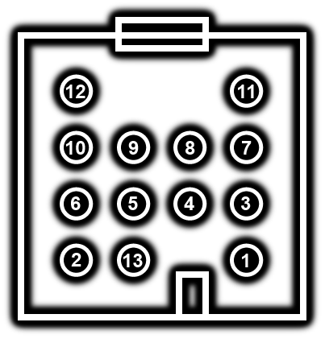
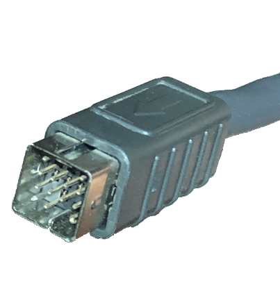
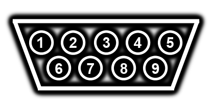
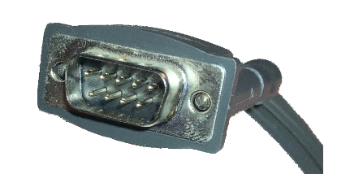
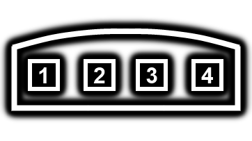
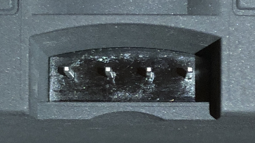
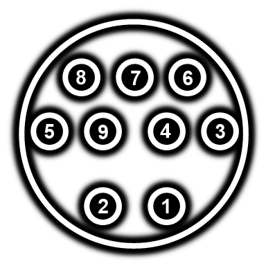
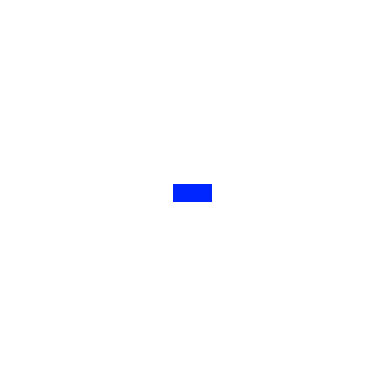

# Pinouts

A collection of pinouts and electrical descriptions for connectors.

**NOTE: These were made using a variety of sources, and I have not been able to 100% verify the validity of every pin. Do your own testing.**

---

## 13-pin Acoustimass Connector (cable: pins)

Source: [0, pg20] [1, pg70]

Note: Cable is one-to-one, so pinout should be identical on Bass Module and Console.

Pin# | Description | Note
--- | --- | ---
1 | Vunreg | Nominal 26v, Max 31.5V
2 | GND |
3 | SPDIF + | 3/11 are twisted pair
4 | Mute | 3v3 = mute, 0v0 = unmute, pulled high in Bass Module
5 | DSP_Shutdown | Not used on production models
6 | AGND | Shield over Audio Right & Left
7 | DGND | Shield for SPDIF +/-
8 | Audio Left - | 8/9 are twisted pair
9 | Audio Left + | 8/9 are twisted pair
10 | Audio Right - | 10/12 are twisted pair
11 | SPDIF - | 3/11 are twisted pair
12 | Audio Right + | 10/12 are twisted pair
13 | SmartSpeaker | Serial data
Shell | SGND | Connected to GND

---

## 9-pin DE9 Satellite Speaker Connector (cable: pins)

Source: Manual pinout of the cable

Pin# | Description | Note
--- | --- | ---
1 | Left Channel, R- | Right driver
2 | Left Channel, R+ | Right driver
3 | GND |
4 | Right Channel, L+ | Left driver
5 | Right Channel, L- | Left driver 
6 | Left Channel, L+ | Left driver
7 | Left Channel, L- | Left driver
8 | Right Channel, R- | Right driver
9 | Right Channel, R+ | Right driver
Shell | GND | 

---

## 4-pin Satellite Connector (speaker: pins)

Source: Manual pinout of the satellite speakers

Pin# | Description | Note
--- | --- | ---
1 | Right Driver + | red terminal, black wire 
2 | Right Driver - | blue terminal, white wire
3 | Left Driver - | blue terminal, white wire
4 | Left Driver + | red terminal, black wire

## 9-pin DIN ETAP/Boselink Connector (cable: pins)

Source: [1, pg69]

Pin# | Description | Note
--- | --- | ---
1 | ? | 
2 | ? |
3 | Zone 2 Left Input | 
4 | Zone 2 Right Input | 
5 | Zone 1 Right Input | 
6 | ? | 
7 | Data | Half-duplex serial data
8 | ? | 
9 | Zone 1 Left Input | 
Shell | GND | 