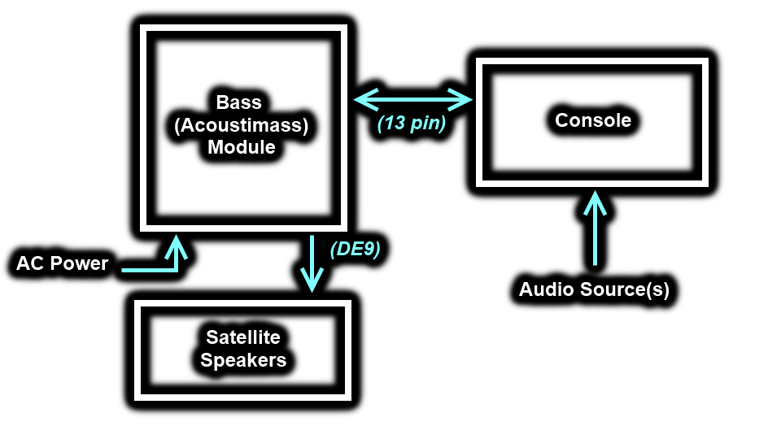

# Bose-Reverse-Engineering

This repository contains a recount of my process of troubleshooting, investigating, and reverse-engineering parts of my Bose 321GS Series III home entertainment system after it stopped working. I began this project on Jun.20.2022.

*When making specific references to some source documents (see sources.md), I'll put a square bracket with [src#, pg#] near it.*

The goal of this investigation was to get a functioning audio system again. I was willing to repair the existing system, but if the issue proved to be too complex for my abilities, I was prepared to do some hardware hacking to make my own solution.

Disclaimer: Despite my efforts, there are still a lot of missing bits and questions left unanswered. I stopped my investigation once I was able to get a functioning system again. If you have any more info feel free to reach out.

## Table of Contents

1. [Introduction](#introduction)
2. [Full Troubleshooting/Investigation](FullTroubleshooting.md)
3. [Pinouts](Pinouts.md)
4. [SmartSpeaker Protocol](SmartSpeakerProtocol.md)
5. [Infrared Remote Codes](RemoteIRCodes.md)
6. [ETAP Protocol](ETAPProtocol.md)
7. [Replacement Unit](ReplacementUnit)
8. [Sources](Sources.md)

---

# Introduction

This system consists of 3 parts; the Console, the Bass Module (sometimes referred to as Acoustimass Module), and the Satellite Speakers. The Console accepts inputs and provides a user interface, the Bass Module serves as the sub-woofer and amplifier, and the Satellite Speakers act as the mid-range drivers. Below is a block diagram of the configuration of our setup.

The Console connects to various audio sources (two analog sources, in our case), and then to the Bass Module using a 13-pin Acoustimass connector. The Bass Module then connects to 120VAC for power, and the two Satellite Speakers via a 9-pin DE9 connector. For pinouts, see the [Pinouts.md](Pinouts.md) document.

---

# The Problem

The unit began misbehaving shortly after a power outage, which makes me think the unit was hit by a surge (PSA: Use surge protectors). The initial symptoms were as follows:

- While playing audio, changing the volume causes the audio to fade out for a second or so.
- After some time, audio randomly stopped playing on its own, and then several (~15) seconds later the unit displayed "3•2•1 Bose" and shut down.
- Upon rebooting, the unit climbs from 0% to 30% volume. During this increase it was lagging (inconsistent jumps and pauses), and then completely froze half-way through. After a delay (~10s) the unit would then shut back down again (without the 321 Bose text).
- *[Did not realize until much later]* The left audio channel does not seem to be working.

# Starting the Investigation

Before tearing into the system, I wanted to try a few things to make sure it wasn't a simple problem. I tried:

1. Removing AC power for 60s to reset all settings
2. Removing and re-seating all external cables
3. Ensuring the "sleep timer" setting is set to off (0)
4. Ensure "hotel mode" is disabled
5. Make sure power switch is set to 115V, not 230V (not present on our unit)
6. Attempt to re-seat the front panel ribbon cable (all controls worked fine, so didn't do this)

After trying these steps and still having issues, I concluded this was a real hardware problem and required a more in-depth investigation. See [Full Troubleshooting/Investigation](FullTroubleshooting.md) for the entire process.

---

Tags to help any other poor souls trying to do something similar in the future find this: bose, acoustimass, smartspeaker, rs232, serial, protocol, standard, cinemate, 321GS III, pinout, DB9, DE9, etap, tap, uart, specification, half-duplex, infrared, remote, boselink, din, driver, satellite

Bose is trademarked and such, no infringement intended.