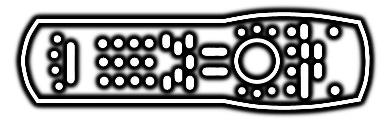

# Remote Control IR Codes

In my journey to build a replacement unit, I wanted to try and use the original remote for changing volume, changing source, etc..

Using a generic (~940nm?) infrared receiver module and an Arduino Uno, I made a small sketch which can read the datacodes and transmission protocol from the remote. This remote uses the standard NEC protocol, and thus sends 4 bytes for each button; a 2-byte Address and then the 2-byte Command. The second byte of both of these is the ones-compliment of the first byte, for redundancy-sake.

Additionally I also used my TC-1 multi-tester's IR feature to read datacodes, but the initial results disagreed with what the Arduino gave. After some squinting I realized each TC1 byte was the reverse of the Arduino byte; this is down to a difference in interpretation of the protocol.

The NEC protocol states data should be ordered LSB (least significant bit) first. I believe the Arduino setup is correctly interpreting using LSB-first, whereas the TC-1 is using MSB (most significant bit)-first. Ultimately it doesn't matter which ordering you use, as long as you're consistent. [Speculation time] I do wonder if the designers of this remote picked data codes with MSB-first in mind, though, due to the 2nd digit of numeric-button codes matching perfectly with the respective number when interpreted as MSB-first.

I have included both the LSB-first and MSB-first datacodes in the table below. The remote only has a single Address code; `BA4B` (MSB-first) / `5DD2` (LSB-first).

---

**Notes:**
- **[A]** Remote only sends signal if the last "source" button pressed was `CD/DVD` or `FM/AM`, or if the `Settings` or `System` button have been pressed and the Exit button has not been pressed.
- **[B]** No signal emitted

**Button** | **Command (MSB)** | **Command (LSB)** | **Note**
--- | --- | --- | ---
Power 		| 4CB3 | 32CD |
Mute 		| 01FE | 807F |
CD/DVD 		| 53AC | CA35 |
FM/AM 		| 06F9 | 609F |
TV 			| 0EF1 | 708F |
CBL/SAT 	| 15EA | A857 |
AUX 		| 0FF0 | F00F | 
Input 		| - | - | [B]
Surround(?) | B04F | 0DF2 | [A]
Settings 	| 807F | 01FE |
System 		| 708F | 0EF1 |
DVD Menu 	| 906F | 09F6 | [A]
Guide 		| D02F | 0BF4 | [A]
Exit 		| 30CF | 0CF3 |
Up/Tune 	| C03F | 03FC | [A]
Left 		| A05F | 05FA | [A]
Enter 		| E01F | 07F8 | [A]
Right 		| 609F | 06F9 | [A]
Down/Tune 	| 20DF | 04FB | [A]
Channel/Track Chapter Up | 19E6 | 9867 | [A]
Channel/Track Chapter Down | 18E7 | 18E7 | [A]
Volume + 	| 03FC | C03F |
Volume - 	| 02FD | 40BF |
Stop 		| 1AE5 | 58A7 | [A]
Pause 		| 56A9 | 6A95 | [A]
Play 		| 55AA | AA55 | [A]
Seek Left 	| 57A8 | EA15 | [A]
Seek Right 	| 58A7 | 1AE5 | [A]
Shuffle 	| 5CA3 | 3AC5 | [A]
Repeat 		| 9D62 | B946 | [A]
1 			| 41BE | 827D | [A]
2 			| 42BD | 42BD | [A]
3 			| 43BC | C23D | [A]
4 			| 44BB | 22DD | [A]
5 			| 45BA | A25D | [A]
6 			| 46B9 | 629D | [A]
7 			| 47B8 | E21D | [A]
8 			| 48B7 | 12ED | [A]
9 			| 49B6 | 926D | [A]
Info 		| 649B | 26D9 | [A]
0 			| 40BF | 02FD | [A]
Previous 	| - | - | [B]
Page Down 	| 6897 | 16E9 | [A]
Page Up 	| 6996 | 9669 | [A]
Record 		| 659A | A659 | [A]
A	 		| 639C | C639 | [A]
B 			| 9F60 | F906 | [A]
C 			| 6798 | E619 | [A]