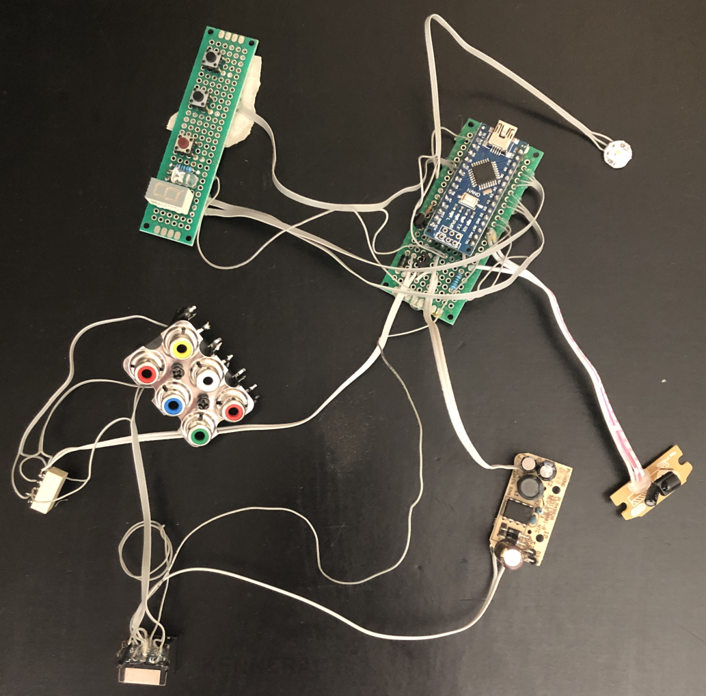

# Solution: Replacement Unit

(This document covers both the [Hardware](#hardware) and [Firmware](#firmware) of the replacement unit)

I have reached the conclusion that constructing a custom replacement Console which mimics my required functionality is easier than repairing the original Console.

I would like this entire process to be as non-destructive as possible, and thus I want to avoid breaking the 13-pin Acoustimass cable or the original Console unit.

I plan to break-out several important connections from the Bass Module to an RJ45 connector and use an Ethernet patch cable to connect to my replacement console. An Ethernet cable was chosen as it consists of four twisted pairs, allowing raw audio signals to be more robust against interference. The replacement console will be able to send raw analog audio to the Bass Module, and control it using derived SmartSpeaker protocol.

# Requirements for the Replacement
- Non-destructively connect to Bass Module
- Turn Bass Module on/off
- Switch between two analog sources
- Change volume & mute
- Adjust bass/treble compensation
- Accept IR commands from the original remote
- Display feedback to user (eg. current volume)

# Hardware
## Theory
Turning the Bass Module on/off, changing volume/muting, and adjusting bass/treble compensation are all SmartSpeaker functions. Controlling the Bass Module via SmartSpeaker commands should be easy; we can use an Arduino Nano to communicate using the (limited) reverse-engineered protocol.

Switching between analog sources should be trivial as well. According to the audio path block diagram in [0, pg11], the path for analog audio through the Console is very simple; it passes through an analog MUX (U4000), through some summing resistors, then through a buffer (U9100), and out to the Bass Module. All volume control and processing is done within the Bass Module itself. This implies we could directly send our analog audio to the Bass Module with essentially no extra circuitry. Using a small relay we can pick between two audio inputs to send.

To non-destructively interface with the Bass Module, I plan to break-out all the important connections to an external JR45 jack, then use a standard Ethernet patch cable to connect it to the replacement console.

Prior testing (see [RemoteIRCodes.md](RemoteIRCodes.md)) has shown the remote uses a standard protocol, and thus receiving commands from it using a standard IR receiver shouldn't be too hard either.

Displaying feedback to the user is one of the trickier aspects. To keep things electrically simple, I could use an RGB LED and a single 7-segment display to convey different meanings (eg. green RGB means volume, and the 7-seg will cycle through each digit of the current volume).

With the above knowledge, I have created a block diagram of all the components to achieve the required functionality.

---
## Connecting to the Bass Module

Before building the replacement console, I first wanted to get all the connections from the Bass Module.

The Bass Module has two primary PCBs; the control board and the I/O board. The IO board holds all the external connectors (AC in, 13-pin, DE9) and is very easy to access once the back of the module has been removed.

Using a DMM and some sewing needles I was able to trace pins from the external 13-pin connector to pads on the I/O board, and soldered small wires onto the desired signals. I used slightly larger wires for the V_UNREG and GND signals as they will be carrying higher currents. I then brought these wires through the vent on the back of the Bass Module and connected them to an JR45 jack, which I then (professionally) hot-glued to the back of the module. See the table and diagram below for the signals and their pinouts.

Acoustimass Pin | RJ45 Pin | Name | Reason
--- | --- | --- | ---
12 | 1 | Right+ | Right analog input
10 | 2 | Right- | Right analog input
13 | 3 | SmartSpeaker | Controlling Bass Module
2 | 4 | GND |
1 | 5 | V_UNREG | Power for replacement unit
4 | 6 | Mute | Exposed just in case, unused
8 | 7 | Left- | Left analog input
9 | 8 | Left+ | Left analog input

---
## Replacement Circuitry

With connections to the Bass Module established, I then moved on to the replacement console's circuitry. I designed a circuit based on the previously shown block diagram, focusing on keeping it simple and using parts I had on hand. See the electrical diagram below.

Notes:
- I'm using the built-in AMS1117-5.0 regulator on the Arduino Nano as the 5V power supply. Current consumption is very low (<75mA) so overheating is not a concern.
- The "12V DC/DC Buck" device (U2) is an external MC34063AB-based buck regulator board which I recycled from an old power adapter. It outputs 11.8V and at least 500mA.
- The decimal point on my 7-segment display is dead, otherwise I would have used it as an indicator rather than the green 5mm LED.
- I learned the hard way that pins A6/A7 on the Arduino Nano do not have any digital driving circuitry behind them; you cannot use them as an output (and other parts of your code can break if you try).
- I intentionally used a small-signals relay (EB2-12) as the extremely low currents would not be enough to prevent contact corrosion in a standard relay.

The KiCad project (KiCad v5.99.0-700-g4ebb87d1c) containing the above circuit can be found under the [Hardware directory](Hardware). The project does not contain a PCB layout due to it using a combination of existing and non-standard parts (eg. the buck regulator board), and that the final implementation has multiple PCBs (eg. the 7seg & buttons are on a separate PCB than the Arduino Nano).

---
## Assembly

I initially had some trouble locating certain components, but after some compromises (eg. using a bank of 6 RCA jacks rather than a bank of 4) I was able to get everything I needed. The construction was fairly easy (due to the bulk of the work being directly connecting components via wires), though working with the small wires was a struggle at times. Testing went well, and after a minimal amount of tweaks everything appeared to be working as expected. Below is a picture of all the assembled components.

Physical construction is currently my weakest area. In the interest of finishing the project in a timely manner, I decided to mount all the components onto a wooden board (in a semi-pleasing way) and call it a day. I made sure that all components could be easily removed in case a future repair or upgrade. Below is the finished replacement console. *(The USB cable is just for the demo; it is not required for the unit to run.)*

# Firmware

**Disclaimer:** This firmware was put together relatively quickly and does not follow the best practices. In the future I would like to re-write the firmware and make several improvements to both the function and the structure, but for now this quick and messy version does the job.

This firmware was designed for the hardware described above, and supports the following features:
- Powering Bass Module on/off
- Changing volume (and muting)
- Adjusting bass & treble compensation
- Changing input source

The Arduino project can be found under the [Firmware directory](Firmware).

**Technical Notes:**
- Interrupts are disabled while sending SK6812 data, thus breaking IR functionality. Luckily, the time required to send data to a single SK6812 chip is just small enough (<50uS) to not interfere significantly. So long as updates are kept to a minimum, this shouldn't be a problem at all.

---
## Usage
- The unit remembers all settings between powering-down and powering-up, BUT will lose settings if power is lost.
- When in the "off" state, the volume can still be adjusted via the up/down buttons (on remote or unit itself).
- The green indicator LED will flash when a valid input (remote or physical button) is received.
- Press the `Power` button on either the remote or the unit itself and wait for the power-up sequence to finish.
- Upon booting, the unit should flash the current volume on the 7-segment display.
- The RGB LED indicates what value you can currently change with the volume up/down buttons (on the remote or the unit).
	- Green -> Volume menu
	- Purple -> Bass compensation menu
	- Blue -> Treble compensation menu
- The unit will default to volume menu (green). You can cycle through menus by using the "`System`" button on the remote.
- You may use the "`Exit`" button on the remote at any time to return to the volume menu.
- Upon changing a value, the unit will flash the new value on the 7-segment display one digit at a time, followed by a delay.
	- The current value will be flashed on repeat, except when changing volume (as to not be distracting during normal use).
- You can mute the unit using the "`Mute`" button on the remote, which will change the RGB LED to red. Repeating this process will unmute and reset to the volume menu.
- You can momentarily press the volume up/down buttons (on either the remote or the unit itself) to increase/decrease the current value by `1`.
	- You may hold either button down to quickly change through values.
- You can select the primary input source using the "`CBL/SAT`" button on the remote, and secondary input source using "`AUX`".
- Pressing the `Power` button again will put the unit into the "off" state. The RGB indicator will turn off once the unit it off.

---
## Bugs / Future Plans
- **GENERAL:** Would like to switch the project over to PlatformIO and generally rewrite/refactor the whole thing.
- **FEATURE:** Would like to save settings to internal EEPROM so they persist through power-loss.
- **FEATURE:** Would like to implement a feature where it flashes a random "splash text" on the 7-seg display upon startup.
	- My 7-segment display code already supports showing alphanumeric strings up to 24 chars long.
- **BUG:** IR remote buttons are too easy to accidentally register multiple presses (eg. if you press `mute` but hold for too long, it counts as a second press and un-mutes).
	- This is a large problem with how IR stuff is handled and may required a completely revised system.
- **BUG:** The "button hold" system for the Infrared remote is very laggy.

- **BUG:** The loading animation noticeably lags when large amounts of serial data is being sent.
	- The animation code is supposed to be async, so this shouldn't be happening.

---
## Acknowledgements
1. Infrared processing was based on the MinimalReceiver sketch from IRRemote library
	- https://github.com/Arduino-IRremote/Arduino-IRremote
2. FastLED SK6812 support added by Jim Bumgardner & David Madison
	- https://www.partsnotincluded.com/fastled-rgbw-neopixels-sk6812/
3. SoftwareSerialWithHalfDuplex is from "nickstedman"
	- https://github.com/nickstedman/SoftwareSerialWithHalfDuplex
4. Memory monitoring library is from "sudar"
	- https://github.com/sudar/MemoryFree/