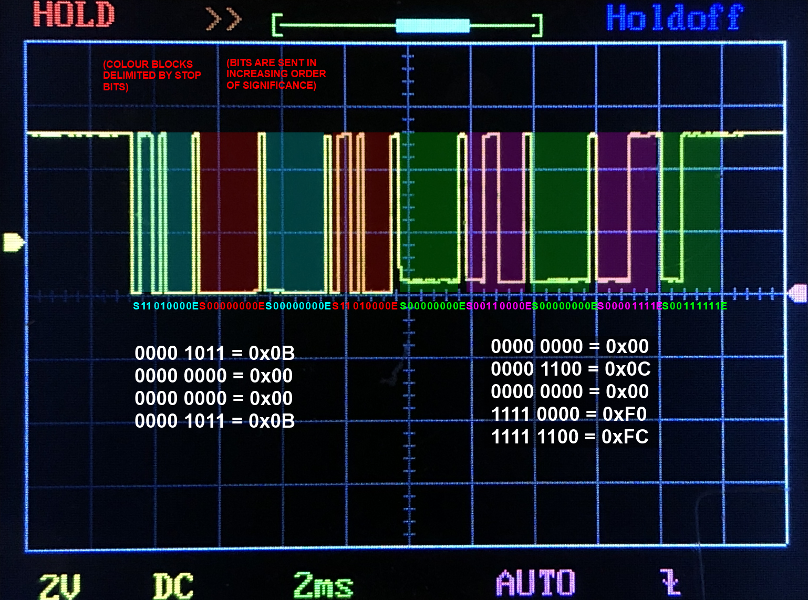

# SmartSpeaker Protocol

TODO: Bump all the serial values in here to a full byte (eg. `F` should be `0F`) for consistency.

## Introduction
The SmartSpeaker protocol is a proprietary protocol which defines a series of commands for controlling an audio device. It appears to be the protocol used for communication between the Console unit and the Bass Module in my theatre setup. Normally it is used by the Console to command the Bass Module to change volume, switch input source, power down, etc.. Each command (request) should be met with a response from the opposing device. This document outlines my efforts to reverse-engineer this protocol.

## Hardware
According to the troubleshooting guide `[0, p20]`, the SmartSpeaker implementation is over a single-wire serial connection; it runs at 4800 baud, is half-duplex & bi-directional. The guide also suggests it uses positive logic with 0V-3.3/5V levels, but my unit seems to use exclusively 0V/5V. A troubleshooting guide for another model `[2, p13]` suggested the data format could be UART; 1 start bit, 8 data bits, no parity bits, and 1 stop bit (8N1), though suggests 3.3V logic levels. Probing with an oscilloscope found the 8N1 UART configuration to be accurate (albeit at 5V).

## Probing
By soldering some wires onto the Bass Module's connector, I was able to see the data exchange between the Console and Bass Module using an oscilloscope. Even while the Console is "off", commands are still being sent to the Bass Module repeatedly. It seems that it is the same command being sent ~25 times per second; below is an analysis of one of these exchanges.

The Bass Module pulls down the signal line to a slightly higher voltage than the Console (as seen by the LOW voltage being slightly higher when the Bass Module is sending vs. the Console is sending), so it is easy to tell where the Console's command stops and the Bass Module's response begins. Based on this, the Console's command is `0B 00 00 0B`, and the Bass Module's response is `00 0C 00 F0 FC`.

## More robust probing
Due to the serial line being a standard configuration (4800 baud, 5V, 8N1), it is trivial to connect it to an Arduino Uno or equivalent. Using the standard SoftwareSerial library (so the hardware serial could be used to communicate with the computer) and respective example sketch, I was able to connect the speaker's serial line into the Arduino's defined RX (receive) pin to get a read-only view of the serial data (see below).

Due to this half-duplex connection being only meant for 2 devices, probing the signal from the outside obfuscates which device is sending what. Without the visual aid of the oscilloscope (observing different logic-low levels), it is impossible to reliably tell where a message is coming from, all we can know for certain is that every-other message is from the same device (as every command from the Console should be met with a response from the Bass Module). Using the time difference between individual messages (responses follow shortly behind requests, and individual commands are relatively spaced out), a reasonable guess can be made to determine the origin of a message. The fact that the Console primarily sends commands of 4 or 5 bytes, and the Bass Module primarily responds with a single 0x00 (OK), makes for a good double-check.

---

## Serial Snooping: Raw Data Exchanges
---
See the bottom of this document for decoded commands.

Below is a table of raw data exchanges between the console and the bass module. Many of the data exchanges are still a mystery to me, but below the table are some commands which I have deciphered.

Data exchange is formatted as successive pairs of `request (response)` data. The request is sent by the console unit, and the response is from the woofer. Some actions result in several different command exchanges going on (in which case commands are displayed in-order). Volume is at 10% for all tests unless otherwise specified.

<b>TABLE: Raw Data Exchanges</b>

Action | Data Exchange | Condition | Note
--- | --- | --- | ---
Plugging AC In to Bass Module | 1 0 80 81 (0),   B 0 10 1B (-) | | None OR malformed response for last command (unsure)
Nothing (Idle) 	| B 0 0 B (0 C 0 F0 FC) 	| Console off | Sent ~25 times / second, continuously.
Nothing (Idle) 	| B 0 0 B (0 C 0 0 C) 	| Console on | Sent ~25 times / second, continuously.
Power On 	| 1 0 0 1 (0),  B 0 12 19 (0 C 0 30 31 30 34 30 30 9),  E 0 0 0 E (0),  D 0 2 F (0),  3 0 10 13 (0),  3 0 30 33 (0),  4 0 35 31 (0),  4 0 5E 5A (0),  4 0 1 5 (0),  6 0 0 6 (0),  6 0 10 16 (0),  8 0 6 E (0),  9 0 10 19 (0),  2 0 78 7A (0),  B 0 F2 F9 (*00 0C 00 00 0C*),  F 0 0 F (0),  2 0 5A 58 (0),  2 0 64 66 (0),  2 0 78 7A (0),  E 0 0 0 E (0),  D 0 2 F (0),  2 0 63 61 (0),  D 0 2 F (0),  5 0 5 0 (0),  6 0 10 16 (0),  4 0 1 5 (0),  6 0 0 6 (0),  9 0 13 1A (0),  [VOLUME RAMP UP] | Console off, booting into AUX mode | The response for the `0B 00 F2 F9` seemed to be repeatedly malformed and had to be deciphered from an oscilloscope trace. `VOLUME RAMP UP` just means there are N commands moving the volume from 0% to N%.
Power Off 	| 2 0 64 66 (0),  2 0 78 7A (0),  [2s delay]  1 0 80 81 (0) | Console on, was at 0% volume. | Appears many commands are re-sending previous settings (eg. volume, source, etc). Also appears volume is ramped down to 0% incrementally before muting shutdown.
Volume 0%	| 2 0 64 66 (0) | |
Volume 5%	| 2 0 5F 5D (0) | |
Volume 10%  | 2 0 5A 58	(0)	| |
Volume 20%  | 2 0 50 52	(0)	| |
Volume 30%  | 2 0 46 44	(0)	| |
Volume 40%  | 2 0 3C 3E	(0)	| |
Volume 50%  | 2 0 32 30	(0)	| |
Volume 60%  | 2 0 28 2A	(0)	| |
Volume 70%  | 2 0 1E 1C	(0)	| |
Volume 80%  | 2 0 14 16	(0)	| |
Volume 90%  | 2 0 A 8 (0)	| |
Volume 100% | 2 0 0 2 (0)	| |
Mute		| 2 0 78 7A (0) | |
Set Bass Compensation +14 | 4 0 5E 5A (0) | |
Set Bass Compensation +13 | 4 0 5D 59 (0) |  |
Set Bass Compensation +12 | 4 0 5C 58 (0) |  |
Set Bass Compensation +1 | 4 0 51 55 (0) |  |
Set Bass Compensation +0 | 4 0 50 54 (0) |  |
Set Bass Compensation -1 | 4 0 40 44 (0) |  |
Set Bass Compensation -2 | 4 0 41 45 (0) |  |
Set Bass Compensation -14 | 4 0 4D 49 (0) |  |
Set Treble Compensation +14 | 4 0 3E 3A (0) |  |
Set Treble Compensation +6 | 4 0 36 32 (0) |  |
Set Treble Compensation +1 | 4 0 31 35 (0) |  |
Set Treble Compensation +0 | 4 0 30 34 (0) |  |
Set Treble Compensation -1 | 4 0 20 24 (0) |  |
Set Treble Compensation -2 | 4 0 21 25 (0) |  |
Set Treble Compensation -14 | 4 0 2D 29 (0) |  |
Change "Audio Processing" setting from "User Adjustable" to "Automatic" | 6 0 10 16 (0),   4 0 1 5 (0),   6 0 0 6 (0) |  | Changing it back did not send any data (presumably because all the user settings were reset to the automatic values)
Enable Movie EQ | 4 0 2 6 (0) |  |
Disable Movie EQ | 4 0 1 5 (0) |  |
Enable Range Compression | 6 0 1 7 (0) |  |
Disable Range Compression | 6 0 0 6 (0) |  |
Enable Mono Decoding | 5 0 5 0 (0),  6 0 11 17 (0) |  |
Disable Mono Decoding | 5 0 5 0 (0),  6 0 10 16 (0) | |
Source: AUX to TV | 2 0 78 7A (0),  4 0 2 6 (0),  E 0 0 0 E (0),  D 0 2 F (0),  4 0 1 5 (0),  E 0 0 0 E (0),  D 0 2 F (0),  2 0 5A 58 (0),  D 0 8 5 (0),  5 0 5 0 (0),  4 0 2 6 (0),  9 0 12 1B (0) | |
Source: AUX to CBL/SAT | 2 0 78 7A (0),  4 0 2 6 (0),  E 0 0 0 E (0),  D 0 2 F (0),  4 0 1 5 (0),  E 0 0 0 E (0),  D 0 2 F (0),  2 0 5A 58 (0),  D 0 4 9 (0),  5 0 5 0 (0),  4 0 2 6 (0),  9 0 12 1B (0) |  |
Source: AUX to CD/DVD | 2 0 78 7A (0),  4 0 2 6 (0),  E 0 0 0 E (0),  D 0 2 F (0),  D 0 C 1 (0),  6 0 10 16 (0),  4 0 1 5 (0),  6 0 0 6 (0),  9 0 10 19 (0) |  |
Source: AUX to FM |2 0 78 7A (0),  4 0 2 6 (0),  E 0 0 0 E (0),  D 0 2 F (0),  4 0 1 5 (0),  E 0 0 0 E (0),  D 0 2 F (0),  2 0 5A 58 (0),  D 0 B 6 (0),  5 0 5 0 (0),  9 0 13 1A (0) |  |
Source: AUX to AM | 2 0 78 7A (0),  4 0 2 6 (0),  E 0 0 0 E (0),  D 0 2 F (0),  4 0 1 5 (0),  E 0 0 0 E (0),  D 0 2 F (0),  2 0 5A 58 (0),  D 0 A 7 (0),  5 0 5 0 (0),  9 0 13 1A (0) |  |
Source: TV to AUX | 2 0 78 7A (0),  E 0 0 0 E (0),  D 0 8 5 (0),  E 0 0 0 E (0),  D 0 8 5 (0),  2 0 5A 58 (0),  D 0 2 F (0),  5 0 5 0 (0),  4 0 1 5 (0),  9 0 13 1A (0) | |
Source: TV to CBL/SAT | 2 0 78 7A (0),  E 0 0 0 E (0),  D 0 8 5 (0),  E 0 0 0 E (0),  D 0 8 5 (0),  2 0 5A 58 (0),  D 0 4 9 (0) |  |
Source: TV to CD/DVD | 2 0 78 7A (0),  E 0 0 0 E (0),  D 0 8 5 (0),  D 0 C 1 (0),  6 0 10 16 (0),  4 0 1 5 (0),  6 0 0 6 (0),  9 0 10 19 (0) |  |
Source: TV to FM | 2 0 78 7A (0),  E 0 0 0 E (0),  D 0 8 5 (0),  E 0 0 0 E (0),  D 0 8 5 (0),  2 0 5A 58 (0),  D 0 B 6 (0),  5 0 5 0 (0),  4 0 1 5 (0),  9 0 13 1A (0) | |
Source: TV to AM | 2 0 78 7A (0),  E 0 0 0 E (0),  D 0 8 5 (0),  E 0 0 0 E (0),  D 0 8 5 (0),  2 0 5A 58 (0),  D 0 A 7 (0),  5 0 5 0 (0),  4 0 1 5 (0),  9 0 13 1A (0) |  |
Source: CBL/SAT to AUX | 2 0 78 7A (0),  E 0 0 0 E (0),  D 0 4 9 (0),  E 0 0 0 E (0),  D 0 4 9 (0),  2 0 5A 58 (0),  D 0 2 F (0),  5 0 5 0 (0),  4 0 1 5 (0),  9 0 13 1A (0) | 
Source: CBL/SAT to TV | 2 0 78 7A (0),  E 0 0 0 E (0),  D 0 4 9 (0),  E 0 0 0 E (0),  D 0 4 9 (0),  2 0 5A 58 (0),  D 0 8 5 (0) | 
Source: CBL/SAT to CD/DVD | 2 0 78 7A (0),  E 0 0 0 E (0),  D 0 4 9 (0),  D 0 C 1 (0),  6 0 10 16 (0),  4 0 1 5 (0),  6 0 0 6 (0),  9 0 10 19 (0) | 
Source: CBL/SAT to FM | 2 0 78 7A (0),  E 0 0 0 E (0),  D 0 4 9 (0),  E 0 0 0 E (0),  D 0 4 9 (0),  2 0 5A 58 (0),  D 0 B 6 (0),  5 0 5 0 (0),  4 0 1 5 (0),  9 0 13 1A (0) | 
Source: CBL/SAT to AM | 2 0 78 7A (0),  E 0 0 0 E (0),  D 0 4 9 (0),  E 0 0 0 E (0),  D 0 4 9 (0),  2 0 5A 58 (0),  D 0 A 7 (0),  5 0 5 0 (0),  4 0 1 5 (0),  9 0 13 1A (0) | 
Source: CD/DVD to AUX | E 0 0 0 E (0),  D 0 C 1 (0),  2 0 5A 58 (0),  D 0 2 F (0),  5 0 5 0 (0),  6 0 10 16 (0),  4 0 1 5 (0),  6 0 0 6 (0),  9 0 13 1A (0) | 
Source: CD/DVD to TV | E 0 0 0 E (0),  D 0 C 1 (0),  2 0 5A 58 (0),  D 0 8 5 (0),  5 0 5 0 (0),  6 0 10 16 (0),  4 0 2 6 (0),  6 0 0 6 (0),  9 0 12 1B (0) | 
Source: CD/DVD to CBL/SAT | E 0 0 0 E (0),  D 0 C 1 (0),  2 0 5A 58 (0),  D 0 4 9 (0),  5 0 5 0 (0),  6 0 10 16 (0),  4 0 2 6 (0),  6 0 0 6 (0),  9 0 12 1B (0) | 
Source: CD/DVD to FM | E 0 0 0 E (0),  D 0 C 1 (0),  2 0 5A 58 (0),  D 0 B 6 (0),  5 0 5 0 (0),  6 0 10 16 (0),  4 0 1 5 (0),  6 0 0 6 (0),  9 0 13 1A (0) | 
Source: CD/DVD to AM | E 0 0 0 E (0),  D 0 C 1 (0),  2 0 5A 58 (0),  D 0 A 7 (0),  5 0 5 0 (0),  6 0 10 16 (0),  4 0 1 5 (0),  6 0 0 6 (0),  9 0 13 1A (0) | 
Source: FM to AUX | 2 0 78 7A (0),  E 0 0 0 E (0),  D 0 B 6 (0),  E 0 0 0 E (0),  D 0 B 6 (0),  2 0 5A 58 (0),  D 0 2 F (0),  5 0 5 0 (0),  9 0 13 1A (0) | 
Source: FM to TV | 2 0 78 7A (0),  E 0 0 0 E (0),  D 0 B 6 (0),  E 0 0 0 E (0),  D 0 B 6 (0),  2 0 5A 58 (0),  D 0 8 5 (0),  5 0 5 0 (0),  4 0 2 6 (0),  9 0 12 1B (0) | 
Source: FM to CBL/SAT | 2 0 78 7A (0),  E 0 0 0 E (0),  D 0 B 6 (0),  E 0 0 0 E (0),  D 0 B 6 (0),  2 0 5A 58 (0),  D 0 4 9 (0),  5 0 5 0 (0),  4 0 2 6 (0),  9 0 12 1B (0) | 
Source: FM to CD/DVD | 2 0 78 7A (0),  E 0 0 0 E (0),  D 0 B 6 (0),  D 0 C 1 (0),  6 0 10 16 (0),  4 0 1 5 (0),  6 0 0 6 (0),  9 0 10 19 (0) | 
Source: FM to AM | D 0 A 7 (0),  2 0 78 7A (0),  2 0 5A 58 (0) | 
Source: AM to FM | D 0 B 6 (0),  2 0 78 7A (0),  2 0 5A 58 (0) | 

---

## Experimentation with custom serial commands
- If the Bass Module is powered down, the absence of the repeated `0B 00 00 0B` command results in it entering a deep-sleep mode, and will fail to respond to the first few commands it receives until it has woken up again. I believe that `0B 00 00 0B` is some kind of keep-alive command, to make sure the Bass Module is always "prepared" to handle another incoming command (even when "shut down"). In my testing, the Bass Module ignores the first ~4 commands it receives if it has entered the deep-sleep mode. I am not sure why this command still gets send once the Bass Module is powered-on as it doesn't seem to go into any type of deep-sleep - it responds to the first command I send, even without the `0B 00 00 0B` constantly being sent.

## Deciphered SmartSpeaker Commands
---
**Observations on the raw data**
- It seems that the first byte is somewhat like a "category", eg. all commands that start with 0x02 are related to volume.
- It also seems that the 2nd byte is very commonly `0x00`.
- It seems very common that, in 4-byte commands, the final byte is the `XOR` of the 3rd and 1st byte. Eg. 02 0 78 ??, ?? = 78 XOR 02 = 7A. I can only assume this is some form of redundancy for verification?
- The only 5-byte command I've ever seen was `E 0 0 0 E`, which seems like some type of special delimiter command as its the only command (I've seen) that starts with `0x0E`, and has no data but zeros. Perhaps it modifies the interpretation of the data following it.

I can see vague patterns in some of the bulk-commands sent during certain actions, but the specific function of several commands still evade me. I may also be missing something simple because of tunnel vision from working on this for so long; perhaps a revisit in the future will reveal something. In the future I would like to test the result of sending individual unknown commands and noting the reaction.

---

Below is a collection of SmartSpeaker commands which I have deciphered using a combination of the above snooping data and some small hints in manuals.

Function | Command | Response | Note
--- | --- | --- | ---
KeepAlive(?) | 0x0B 0x00 0x00 0x0B | 0x00 0x0C 0x00 0x00 0x0C (bass module on),  0x00 0x0C 0x00 0xF0 0xFC (bass module off) | Idle / keepalive command? Bass module still appears to remain awake if this command is not repeatedly sent.
Mute Volume | 0x02 0x00 0x78 0x7A | 0x00 (OK) |
Set Volume ("Attenuation") | 0x02 0x00 nn qq | 0x00 (OK) | Set volume (also un-mutes), where `nn` = (`100-vol`) (range from `0x00` (100%) to `0x64` (0%)) and `qq` = (`nn XOR 0x02`) (I've seen it this referred to as "counts", where x counts is 100-x percent)
Set Treble Compensation | 0x04 0x00 nn qq | 0x00 (OK) | Level range is `-14` to `+14`. `nn` = (`48+lvl`) for level `0` to `+14` (range from `0x30` (0) to `0x3E` (+14)), or `nn` = (`31-lvl`) for `-1` to `-14` (range from `0x20` (-1) to `0x2D` (-14)). `qq` = (`nn XOR 0x04`)
Set Bass Compensation | 0x04 0x00 nn qq | 0x00 (OK) | Level range is `-14` to `+14`. `nn` = (`80+lvl`) for level `0` to `+14` (range from `0x50` (0) to `0x5E` (+14)), or `nn` = (`63-lvl`) for `-1` to `-14` (range from `0x40` (-1) to `0x4D` (-14)). `qq` = (`nn XOR 0x04`)
Power Down | 0x01 0x00 0x80 0x81 | 0x00 (OK) | Volume should be muted before this is run. I think this puts the Bass Module into a form of sleep akin to shutdown (as it doesn't have a real "shutdown" mode.)
? | 0x0D 0x00 0x03 0x0E | 0x00 (OK) | SOURCE TYPE ("selects S/PDIF input") according to [1, pg63].
? | 0x0D 0x00 0x02 0x0F | 0x00 (OK) | SOURCE TYPE ("selects analog inputs") according to [1, pg62].
? | 0x0E 0x00 0x00 0x00 0x0E | 0x00 (OK) | STREAM METEDATA ("sets stream type") according to [1, pg62].
? | 0x01 0x00 0x00 0x01 | 0x00 (OK) | Wake system (1st send), remain muted (2nd send). See [1, pg62].